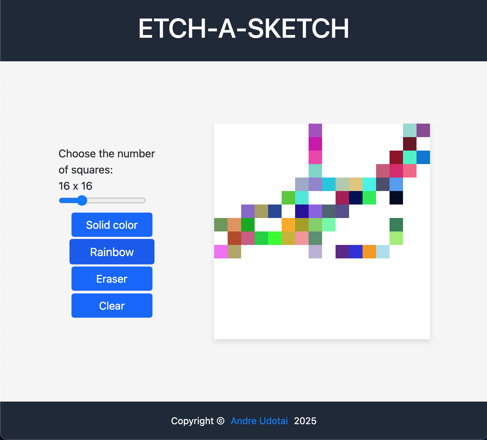

# Etch-A-Sketch



A web-based Etch-A-Sketch application that allows users to create pixel art by drawing on a customizable grid. Users can choose between different drawing modes, including solid color, rainbow, and eraser, and can adjust the grid size to their preference.

## Features

- **Customizable Grid**: Adjust the grid size from 1x1 to 64x64 using a slider.
- **Drawing Modes**:
  - **Solid Color**: Draw with a selected color from the color palette.
  - **Rainbow Mode**: Draw with random colors for each cell.
  - **Eraser**: Erase cells by setting their background to white.
- **Clear Button**: Reset the grid to a blank state.
- **Responsive Design**: Works seamlessly on both desktop and mobile devices.

## Technologies Used

- **HTML**: Structure of the application.
- **CSS**: Styling and layout, including responsive design.
- **JavaScript**: Functionality for grid creation, drawing modes, and user interactions.

## How to Use

1. Open the application in your browser.
2. Use the slider to adjust the grid size. The current size is displayed above the slider.
3. Select a drawing mode:
   - **Solid Color**: Click the "Solid color" button and choose a color from the palette.
   - **Rainbow Mode**: Click the "Rainbow" button to draw with random colors.
   - **Eraser**: Click the "Eraser" button to erase cells.
4. Click and drag your mouse over the grid to draw.
5. Use the "Clear" button to reset the grid.

## Installation

1. Clone the repository:
   ```bash
   git clone https://github.com/AndreUdotai/Etch-A-Sketch.git

2. Open the index.html file in your browser to start using the app.


Future Improvements
Add a save feature to download the drawing as an image.
Implement undo/redo functionality.
Add more drawing tools, such as shapes and patterns.
License
This project is licensed under the MIT License. See the LICENSE file for details.

Author
Developed by Andre Udotai.